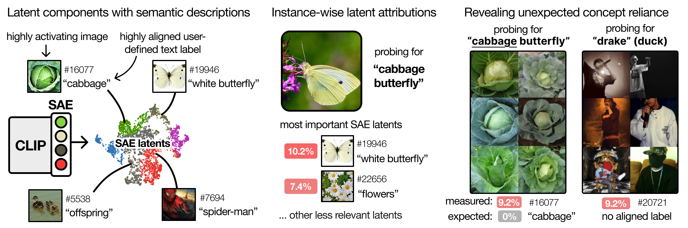
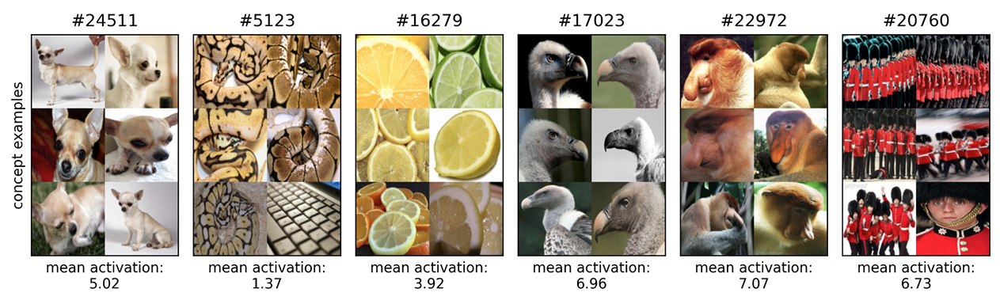
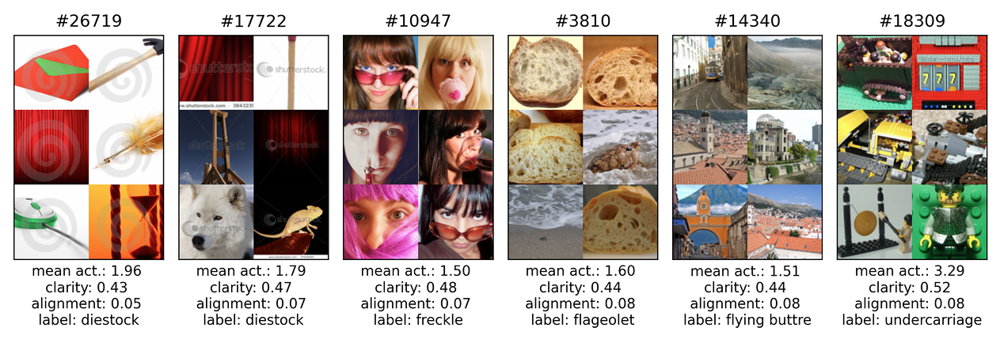
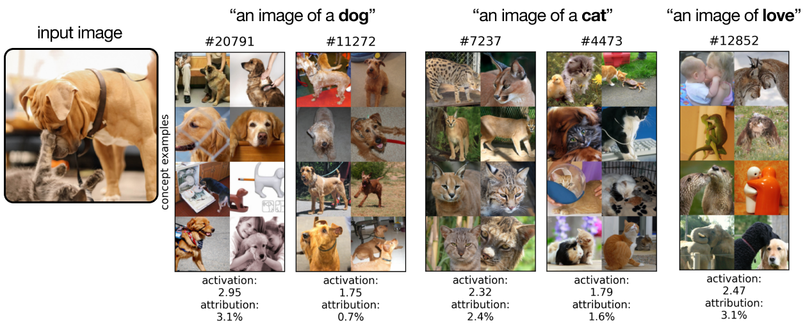

# 🔍 From What to How — Attributing CLIP's Latent Components

**Transformer-based CLIP models are widely used for text-image probing and feature extraction.** This makes it relevant to understand their internal mechanisms.
This repository presents a scalable framework for attributing **Sparse Autoencoder (SAE)** components in CLIP models — revealing not just *what* they encode, but *how* they drive predictions.


<div align="center">

</div>

---

## 🚧 Project Status

This repository is **under development**. Features are being added step by step, and interfaces may evolve.

You're welcome to explore, open issues, or contribute — but please note that some scripts may be incomplete or experimental.

## 🧠 Key Features

📈 **Sparse Autoencoder Training Pipeline**  
Train Sparse Autoencoders (SAEs) on CLIP embeddings to uncover internal representations.

🔍 **Component-Level Interpretability**
<ul>
  <li>Visualize features and assign semantic labels to neurons.</li>
  <li>Score alignment between neurons and textual concepts to reveal what CLIP encodes (and what it doesn’t).</li>
</ul>


⚙️ **Attribution Scores** *(WIP)*  
Estimate how individual latent components contribute to CLIP's output.

🧮 **Faithfulness Evaluation** *(WIP)*  
Evaluate deletion and insertion-based faithfulness of component attributions.

🧪 **Failure Mode Analysis** *(WIP)*  
Probe where CLIP's text-image alignment struggles:
<ul>
  <li><strong>Polysemous words:</strong> <em>Jaguar</em> (animal vs. car), <em>Kite</em> (bird vs. toy)</li>
  <li><strong>Compound nouns:</strong> <em>Cabbage butterfly</em>, <em>Egyptian cat</em></li>
  <li><strong>Visual text:</strong> Logos, typography</li>
  <li><strong>Spurious correlations:</strong> <em>Beaver & water</em>, <em>Fish & fishermen</em></li>
</ul>

### Supported CLIP models:
Most CLIP models from OpenCLIP are supported, including:

| Model ID                               | Architecture   | Hidden Dim | Params (M) |
|----------------------------------------|----------------|------------|------------|
| `clip_vit_b32_datacomp_m_s128m_b4k`    | ViT-B/32       | 768        | 151.3      |
| `clip_vit_b32_laion400m_e32`           | ViT-B/32       | 768        | 151.3      |
| `clip_vit_b32_laion2b_s34b_b79k`       | ViT-B/32       | 768        | 151.3      |
| `clip_vit_b32_datacomp_xl_s13b_b90k`   | ViT-B/32       | 768        | 151.3      |
| `clip_vit_b16_datacomp_xl_s13b_b90k`   | ViT-B/16       | 768        | 149.6      |
| `clip_vit_l14_datacomp_xl_s13b_b90k`   | ViT-L/14       | 1024       | 427.6      |
| `clip_vit_l14_336_openai`              | ViT-L/14-336   | 1024       | 427.9      |
| `clip_vit_h14_dfn5b`                   | ViT-H/14       | 1280       | 986.1      |

---

## 📦 Installation

```bash
# Clone the repository
git clone https://github.com/your-username/semanticlens.git
cd semanticlens

# Create and activate environment (example with Python 3.10)
python3.10 -m venv .venv
source .venv/bin/activate

# Install dependencies
pip install -r requirements.txt
```

Secondly, we need to download the **ImageNet** dataset. To do so, visit
the [ImageNet website](https://image-net.org/download.php) and download the training and validation images.

## Configuration Files
All scripts use configuration files located in the `configs` directory. You can find example configurations for SAE training in `configs/train_sae`.
We also provide config generators that can be used to create new configuration files. 
Please also note that Wandb configs and dataset paths have to be defined in the `configs/local_config.yaml` file.


## Train Sparse Autoencoder

Scripts to train sparse autoencoders on CLIP embeddings are provided in the `model_training` directory.
Configuration files for training are located in `configs/train_sae`.
In the config, you can specify the model to train, the dataset to use, and various training parameters such as learning rate,
batch size, and number of epochs.

```bash
# Train a Sparse Autoencoder on CLIP embeddings
python3 -m model_training.train_sae --config_file $config_file
```
where `$config_file` is the path to the configuration file for training.

## Explore What CLIP Components Encode
To understand what CLIP components encode, we provide scripts for feature visualization and semantic alignment scoring.
### Preprocessing
We first need to collect highly activating examples for each component. This is done by
```bash
# Collect highly activating examples for each component
python3 -m preprocessing.compute_latent_features_minimal --config_file $config_file --split 'train'
```
where `$config_file` is the path to the configuration file for collecting examples.

For semantic alignment scoring, we need to compute visual embeddings of the MobileCLIP-S2 model. To do this, we can use the following command:
```bash
# Compute visual embeddings of MobileCLIP-S2 model
python3 -m preprocessing.compute_visual_embeddings --config_file 'configs/imagenet/local/clip_vit_mobiles2_datacompdr_imagenet.yaml'
```
where `$config_file` is the path to the configuration file for computing visual embeddings.

### Feature Visualization
<div align="center">

</div>

To visualize the highly activating samples of components, we can use the following command:
```bash
# Visualize features of the components
python3 -m experiments.visualize_components --config_file $config_file --components '0,1,2,3,4,5,6,7,8,9'
```
where `$config_file` is the path to the configuration file for visualizing features and `components` specifies the components to visualize.

### Find Semantically (Un-)Aligned Components
<div align="center">

</div>

To find semantically (un-)aligned components with high activation magnitudes, we can use the following script:
```bash
python3 -m experiments.find_relevant_semantics --config_file $config_file --most_aligned 'False' --min_activation 1.0 --custom_prompt ''
```
where `$config_file` is the path to the configuration file for finding semantic outliers, `most_aligned` specifies whether to find the most aligned or least aligned components, and `min_activation` specifies the minimum activation threshold for the components.
Further, `custom_prompt` can be used to specify a custom prompt for the search. If left empty, the ImageNet-21k class labels are used.

## Explore How CLIP Components Contribute to Predictions
To explore how CLIP components contribute to predictions, we provide scripts for attribution scoring.

### Attribution Scoring
<div align="center">

</div>

To compute the most relevant components for a given text prompt and image, we can use the following command:
```bash
python3 -m experiments.compute_attribution_scores --config_file $config_file --text_prompt 'a photo of a cat' --img_url 'your_image_path.jpg'
```

where `$config_file` is the path to the configuration file for computing attribution scores, 
`text_prompt` is the text prompt to use,
and `img_url` is the path to the image.

## Citation

Please feel free to cite our work, if used in your research:

```bibtex
@article{dreyer2025attributing,
  title={From What to How: Attributing CLIP's Latent Components Reveals Unexpected Semantic Reliance},
  author={Dreyer, Maximilian and Hufe, Lorenz and Berend, Jim and Wiegand, Thomas and Lapuschkin, Sebastian and Samek, Wojciech},
  journal={arXiv preprint arXiv:2505.20229},
  year={2025}
}
```